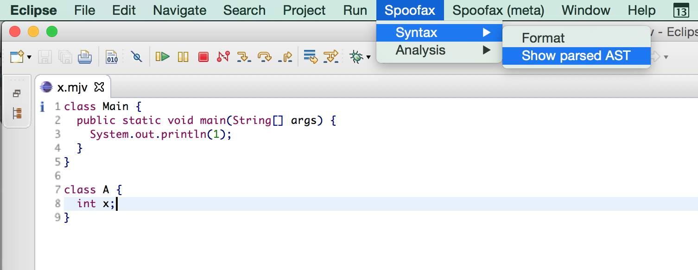



In this lab, you define the concrete and abstract syntax of MiniJava in Spoofax.
From this definition, you generate an Eclipse editor, that provides syntax checking, error recovery and syntax highlighting.

## Overview

### Objectives

Develop a syntax definition for MiniJava in SDF3 and generate an Eclipse editor from it.
The definition should include:

1. A lexical syntax definition for
  * sort `ID`,
  * sort `INT`,
  * whitespaces,
  * single line comments and
  * nested block comments.
2. A context-free syntax definition for sorts
  * `Program`,
  * `MainClass`,
  * `ClassDecl` (including `FieldDecl`),
  * `VarDecl`,
  * `MethodDecl` (including `ParamDecl`),
  * `Type`,
  * `Statement` and
  * `Exp`.

    For grading, it is required to comply with all sort names literally.
    {: .notice .notice-warning}

3. Constructor names for context-free syntax rules.
4. Disambiguation rules.


### Submission

You need to submit your MiniJava project with a pull request against branch `assignment2` on GitHub.
The [Git documentation](/documentation/git.html#submitting-an-assignment) explains how to file such a request.

The deadline for submission is September 27th 2017, 23:59.
{: .notice .notice-warning}

### Grading

You can earn up to 100 points for your concrete syntax definition.
Therefore, we run 355 test cases against your implementation.
You earn points, when your implementation passes test cases.
The total number of points depends on how many test cases you pass in each of the following groups:

* lexical syntax (20 points)
  * `ID` (2 point)
  * `INT` (2 point)
  * whitespace (2 point)
  * line comments (2 point)
  * simple block comments (2 point)
  * nested block comments (challenge, 10 points)
* context-free syntax (40 points)
  * `Program` (3 point)
  * `MainClass` (3 points)
  * `ClassDecl` (including `FieldDecl`) (4 points)
  * `MethodDecl` (including `VarDecl`, `ParamDecl`) (7 points)
  * `Type` (2 points)
  * `Statement` (6 points)
  * `Exp` (15 points)
* disambiguation (40 points)
  * associativity (15 points)
  * precedence (25 points)

### Early Feedback

We provide early feedback for the correctness of your syntax definition.
This feedback gives you an indication which parts of your syntax definition might still be wrong.
It includes a summary on how many tests you pass and how many points you earn by passing them.
You have 3 early feedback attempts.

## Detailed Instructions

### Preliminaries

#### Git Repository

You continue with your work from the previous assignment.
See the [Git documentation](/documentation/git.html#continue-from-previous-assignment) on how to create the `assignment2` branch from your previous work.

### Agile Software Language Engineering

Spoofax supports short development cycles.
This enables you to develop your syntax definition step by step.
In each step, you focus on a single aspect,
 for example a particular nonterminal symbol or a particular grammar rule.
After each step, you can check your progress by building the project and running your test cases.
This requires you to declare the same start symbols in your syntax definition as in your test suites.

Once you build your project, Spoofax will run all the tests in your test project automatically.
When you have many tests, Spoofax might not be able to handle them. If you experience delays, you can split tests into more files, comment out bigger tests, or close the test project.
{: .notice .notice-warning}

You can also test the generated editor in the same Eclipse instance.
This requires you to specify the start symbol that is used by the editor
  in `editor/Syntax.esv`.
Of course, this should also be a start symbol in your syntax definition.
You can test the editor by first building your project and opening a MiniJava program.  

To get feedback on the building progress, open the console on Eclipse by accessing *Window*, *Show View*, and selecting *Console*. In some cases, it is necessary to select *Other* and then type *Console*.
{: .notice .notice-warning}

In Eclipse, you build a project by choosing *Build Project* from the *Project* menu or by pressing the corresponding keyboard shortcut (OS X: Cmd + Alt + B, Enter).
When you later rebuild your project, any open MiniJava editor is updated to the new version you just built.

You can also use *Show parsed AST* in the editor's *Spoofax* -> *Syntax* menu to test your abstract syntax definition interactively.
When you change a MiniJava program in the editor, it is necessary to select *Show parsed AST* again to visualize its corresponding AST.
You might notice that the editor will give you an AST even for syntactically incorrect programs.
This is because Spoofax editors support syntactic error recovery.



### Syntax Definition

You should define your syntax in [SDF3](http://www.metaborg.org/en/latest/source/langdev/meta/lang/sdf3/index.html).
You can start by opening the file `syntax/minijava.sdf3` in your minijava project.
When you save this file, you should get a corresponding file `src-gen/syntax/minijava.sdf`.
You can also split your syntax definition over several modules in `syntax/` and import modules into module `minijava`.


```
module minijava

imports

  common
```

The module already imports a module `common`, which you can find in any initial Spoofax editor project.
This module provides syntax definitions for common lexical sorts such as identifiers, integers, strings, and whitespace, including single line and block comments.

For more information on how to write SDF3 syntax definitions, also check the documentation on how to define a language in [Spoofax](http://www.metaborg.org/en/latest/source/langdev/meta/lang/tour/syntax.html).
{: .notice .notice-warning}

#### Context-free Syntax

Start with the context-free syntax of the language.
Use the context-free grammar in the *MiniJava Language Reference Manual* as a reference.

When you define your syntax definition bottom-up, you start with sorts such as `Type` and `VarDecl`.
This allows you to run your tests frequently and check your progress.

We recommend to use *template productions* for your context-free syntax definition, since they help when generating artifacts other than just the parser.
When you use template productions, you need to make sure that templates are correctly tokenised.
Otherwise, the parser would reject layout in certain positions, for example between `[` and `]` in an array type.
Check the SDF3 documentation for details.
In case you want to use `<` or `>` as symbols inside a template, you can use alternate template brackets `[...]`.

You need disambiguation constructs to disambiguate your syntax definition.
You can specify the associativity with attributes `left`, `right`, or `non-assoc` (See [documentation](http://www.metaborg.org/en/latest/source/langdev/meta/lang/sdf3/reference.html#attributes)).
These attributes are added to the end of a rule:

```
context-free syntax

  Exp.Constr1 = ... {left}
```

You can specify precedence in a `context-free priorities` section.
In this section, you order groups of rules:

```
context-free priorities

  {
    Exp.Constr1
    Exp.Constr2
  } > { ... } > ...
```

You can also define the associativity of a group:

```
context-free priorities

  { left:
    Exp.Constr1
    Exp.Constr2
  } > { ... } > ...    
```
Finally you should also consider specifying a `bracket` rule for disambiguation of expressions.

#### Lexical Syntax

Continue with the lexical syntax definition including identifiers, integer, and simple layout.
The `common` module in `syntax/common.sdf3` provides already definitions, but these do not comply with MiniJava.
You can either fix these definitions in `common`, or define and import your own module and use `common` only for inspiration.

First, define lexical syntax rules:

```
lexical syntax

  ID     = ...
  INT    = ...
  LAYOUT = ...
```

Second, define follow restrictions to ensure longest matches:

```
lexical restrictions

  ID -/- ...
  INT -/- ...

context-free restrictions

 LAYOUT? -/- ...
```

Finally, use rejection rules to rule out reserved words.

```
lexical syntax

  ID = ... {reject}
```

You now can check your tests. It is important to get your grammar working at this stage. Do not move on if you have issues here, since there is a high chance that these issues influence your other tests as well. If you experience weird behaviour on your tests, this is most likely caused by an erroneous definition of `LAYOUT`.
{: .notice .notice-danger}

Finally, you should add lexical syntax rules for comments to your syntax definition.
Start with single line comments.
Continue with unnested block comments.
Do not forget to define follow restrictions.

### Editor Services

When developing a language in Spoofax, the syntax definition written in SDF3 does not produce only a parser but other editor services as well.

#### Pretty Printing

Spoofax generates pretty-printing rules from your syntax definition.
You can find these rules in `src-gen/pp/<name>-pp.str`.

In order to test the pretty-print builder, you need to build your project.
Your MiniJava editor provides a menu entry named `Format` that uses these generated rules to pretty-print a MiniJava file.
Create or open a `.mjv` test file with a valid program, go to the *Spoofax* -> *Syntax* menu and choose `Format`.
This will apply `Format` to the current file and show the result in a new editor.

If your start symbols are not defined in the main SDF3 module, you might need to import the generated `src-gen/pp/*-pp.str` files into `trans/pp.str`.
{: .notice .notice-warning}

Typically, the pretty-printed code lacks proper indentation and line breaks.
You can fix this by improving your templates in the syntax definition.
The pretty-printer follows the indentation and line breaks from the syntax definition.

You should improve your syntax definition in order to get readable code with a consistent indentation.
You might read on [indent styles](http://en.wikipedia.org/wiki/Indent_style) for some inspiration.

Make sure that your altered syntax definition is still correct and can be used to parse MiniJava programs.
{: .notice .notice-warning}

#### Syntactic Code Completion

Together with a pretty-printer, Spoofax also automatically derives syntactic code completion from the syntax definition. This feature allows for example, for new users to discover the language's syntax while editing the program. To know more details about syntactic code completion in Spoofax, check the [documentation](http://metaborg.org/en/latest/source/release/migrate/new_completions_framework.html).


### Challenge

Challenges are meant to distinguish excellent solutions from good solutions.
Typically, they are less guided and require more investigation or higher programming skills.
{: .notice .notice-success}

This lab's challenge is to support nested block comments.
